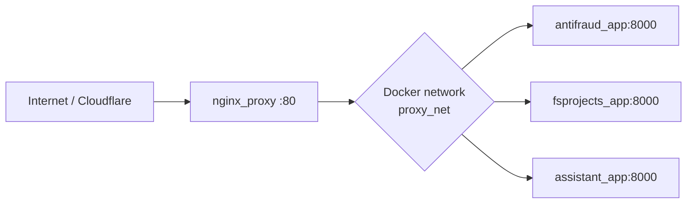

# nginx_proxy

Minimal `Nginx` reverse proxy for the shared Docker network `proxy_net`.

This repository acts as the public entry layer for multiple portfolio services and routes incoming traffic to the correct internal containers by hostname.

## Quick Links

- [Overview](#overview)
- [Routing Map](#routing-map)
- [Production URLs](#production-urls)
- [Architecture](#architecture)
- [Nginx Behavior](#nginx-behavior)
- [Repository Contents](#repository-contents)
- [Run](#run)
- [Health Checks](#health-checks)

## Overview

This proxy is responsible for:

- accepting public HTTP traffic on port `80`;
- routing requests to internal Docker services inside `proxy_net`;
- keeping backend containers private and non-published;
- resolving containers through Docker DNS so service recreation does not require hard-coded IPs.

## Routing Map

- `antifraud.pp.ua` -> `antifraud_app:8000`
- `fsprojects.pp.ua` -> `fsprojects_app:8000`
- `assistant.fsprojects.pp.ua` -> `assistant_app:8000`

## Production URLs

- `https://antifraud.pp.ua/`
- `https://fsprojects.pp.ua/`
- `https://assistant.fsprojects.pp.ua/`

## Architecture



```text
Internet / Cloudflare
        |
        v
   nginx_proxy :80
        |
        v
   Docker network: proxy_net
      |- anti_fraud_analytics_platform
      |    `- antifraud_app:8000
      |
      |- fsprojects
      |    `- fsprojects_app:8000
      |
      `- ai_knowledge_assistant
           `- assistant_app:8000
```

## Nginx Behavior

`nginx_proxy` does not contain application logic. It acts strictly as the edge routing layer:

1. receives the public request from Cloudflare or a direct client;
2. inspects the `Host` header;
3. selects the matching upstream inside `proxy_net`;
4. forwards the original host and `X-Forwarded-*` headers;
5. returns the upstream response to the client.

Runtime request path:

```text
Client
  -> Cloudflare
    -> nginx_proxy
      -> antifraud_app
      -> fsprojects_app
      -> assistant_app
```

The main config relies on:

- `resolver 127.0.0.11 valid=10s ipv6=off;`
- `proxy_pass http://$upstream;`

That setup helps with three production concerns:

- it avoids stale container IP assumptions after recreate or restart;
- it prevents the proxy from being tightly coupled to one fixed upstream address;
- it keeps `antifraud`, `fsprojects`, and `ai_knowledge_assistant` independently routable behind the same edge service.

## Repository Contents

- [`docker-compose.yml`](file:///Users/drhtka/Downloads/Projects/Llm_ml_RAG/nginx_proxy/docker-compose.yml) - launches the `nginx` container
- [`nginx.conf`](file:///Users/drhtka/Downloads/Projects/Llm_ml_RAG/nginx_proxy/nginx.conf) - host-based routing and proxy rules
- [`instruction.md`](file:///Users/drhtka/Downloads/Projects/Llm_ml_RAG/nginx_proxy/instruction.md) - deployment and debugging notes

Related backend project:

- [`ai_knowledge_assistant`](file:///Users/drhtka/Downloads/Projects/Llm_ml_RAG/ai_knowledge_assistant)

## Run

```bash
docker network create proxy_net
cd /home/drhtka/projects/nginx_proxy
docker compose up -d
```

## Health Checks

```bash
docker compose ps
docker compose logs --tail=50 nginx
curl -I -H 'Host: assistant.fsprojects.pp.ua' http://127.0.0.1/health
curl -I -H 'Host: fsprojects.pp.ua' http://127.0.0.1/
```
